markdown

# AWS_EKS_CICD_Chaos_Engineering

## Overview

This project covers the following topics:

- **Kubernetes Manifest Files and Helm Charts:**

  - Created Kubernetes manifest files for MySQL database, API, and web microservices (available under the folder `k8s manifests`).
  - Created Helm chart templates (available under the folder `helm`).

- **Infrastructure as Code (IaC) with Terraform and CloudFormation:**

  - Wrote IaC using Terraform and set up a remote backend to store the state file in an S3 bucket, a DynamoDB table to lock the state file, and configured Terraform dev workspace (available at `./IaC/Terraform/`).
  - Set up a highly available (HA) Vault cluster in EKS and accessed secrets in Terraform using the Terraform Vault provider (available at `./IaC/Terraform/vault.tf`).
  - Created an EKS cluster using Terraform (available under `./IaC/Terraform`) and deployed the MySQL database in the cluster using the Helm Terraform provider.

- **CI/CD Pipeline Setup:**

  - Set up a CI/CD pipeline for web and API microservices to build source code, build Docker images, push images to ECR, create Helm packages, push the packages to ECR, and deploy the Helm packages to the EKS cluster in the dev namespace with an auto-rollback feature.

- **Chaos Engineering and Cluster Management:**
  - Demonstrated Chaos Engineering using the Litmus Chaos tool.
  - Set up a cluster auto-scaler to automatically scale in or out the cluster size/nodes.

**Tools Used:** EKS, Terraform, Helm, Vault, Litmus Chaos, ECR, CodeBuild, CodePipeline, Docker, GitHub, Cluster Auto-scaler, etc.

**TODO:** Modify Helm charts to include a Vault sidecar agent to inject secrets from Vault.

## Vault Setup

We will use Vault to store the required secrets for our application. We will store `db_name`, `db_username`, `db_password`, and `db_root_password` in the HA Vault.

**NOTE:** The Vault cluster is in a separate EKS cluster from the application EKS cluster for higher resilience and availability.

Follow these steps:

1. Set up a Vault HA cluster and enable auto unseal. Complete instructions are available [here](https://github.com/Hukmaram28/HA_Vault_Cluster_EKS/).

2. Exec to the leader vault pod and store secrets in kv-v2 engine and create a policy and a role. To do so please execute below commands-

   ```
   export VAULT_TOKEN=""
   vault secrets enable -path=crypteye kv-v2
   vault kv put crypteye/database/config db_name="db" db_username="admin" db_password="password"
   ```

   ```
   vault policy write terraform - <<EOF
   path "crypteye/data/database/config" {
   capabilities = ["read"]
   }
   EOF
   ```

   ```
   vault auth enable approle
   ```

   ```
   vault write auth/approle/role/terraform token_policies=terraform
   ```

   ```
   vault read auth/approle/role/terraform/role-id
   ```

   ```
   vault write -f auth/approle/role/terraform/secret-id
   ```

3. Copy role_id, secret_id, vault host url and provide them in `Iac/Terraform/variables.tf` file before creating the infrastructure, thus terraform will read the secrets from the vault server and use the db credentials to create the mysql database on its first execution. This is just to demonstrate how to access Vault in terraform. To use vault secrets in the pods we should use vault sidecar agent to inject secrets in the containers.

## EKS cluster setup [Separate cluster than Vault]

1. Bring up EKS cluster and create a namespace called dev to deploy the microservices. IaC for the cluster can be found in `IaC/terraform` folder. The script does following:

   - Using main.tf we are creating an EKS cluster with 2 t3.medium nodes.
   - Using kubernetes.tf we are connecting to the EKS cluster and creating a namespace called `dev`.
   - Using helm.tf, we are deploying our mysql database helm chart.
   - Using vault.tf, we are accessing db credentials from vault server to make the credential available to the mysql container.

2. Create an OIDC provider to use IAM roles in the EKS cluster (If it is not created while cluster creation):

```
eksctl utils associate-iam-oidc-provider --cluster my-cluster --approve
```

3. Before deploying mysql helm chart, we need to enable volume support with EBS CSI driver add-on if it is not done during cluster creation (you can comment out helm.tf content during the first execution to avoid database deployment as it will fail).

Run the following commands:

```
eksctl create iamserviceaccount \
 --name ebs-csi-controller-sa \
 --namespace kube-system \
 --cluster my-cluster \
 --attach-policy-arn arn:aws:iam::aws:policy/service-role/AmazonEBSCSIDriverPolicy \
 --approve \
 --role-only \
 --role-name AmazonEKS_EBS_CSI_DriverRole --region us-east-1
```

```
eksctl create addon \
 --name aws-ebs-csi-driver \
 --cluster my-cluster \
 --service-account-role-arn arn:aws:iam::$(aws sts get-caller-identity --query Account --output text):role/AmazonEKS_EBS_CSI_DriverRole --region us-east-1
```

```
eksctl utils migrate-to-pod-identity --cluster my-cluster --approve
```

4. If PVC is still unable to create, delete the existing storage class and recreate it with the binding mode set to Immediate using file
   `./StorageClass/gp2.yaml`.

   Run below commands:

   `kubectl delete sc gp2`
   `kubectl apply -f ./StorageClass/gp2.yaml`

Now uncomment helm.tf and db helm chart can be deployed by running `terraform apply`.

5. Mysql db server is deployed as part of infrastructure as this is a one time time activity, This can be done manually too using the helm chart available at `./helm/db`. The db credentials can be provided in the variables.tf file before applying the IaC Scripts or they can be read from vault server.

## CICD Pipeline setup

1. **Automate Deployment with CodePipeline:**

   - To automate the deployment of the web and API microservices to the EKS cluster using CodePipeline, we will make changes to the `buildspec.yaml` files to:
     - Install Helm
     - Template out the Helm `values.yaml` file
     - Package the Helm chart
     - Push the Helm chart to ECR
     - Connect to the Kubernetes cluster
     - Install/Upgrade the Helm package to the EKS cluster. In case of deployment failure, we should rollback to the previous Helm release.

2. **Assign IAM Role to CodeBuild:**

   - To allow CodeBuild to work properly, we need to assign an IAM role with specific AWS managed policies. Create an IAM role with a name like `CodeBuildEKSRole` and attach the following policies to it (refer to `./CodeBuildEKSRole.sh`):

   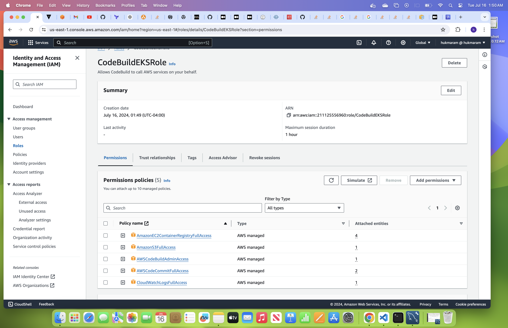

3. **Configure RBAC for CodeBuild:**

   - Even though the CodeBuild role has permission to authenticate to the cluster, it doesn’t have the required RBAC access to perform other actions on the cluster. So we need to edit the `aws-auth` configmap:

   ```
   eksctl create iamidentitymapping --cluster my-cluster --arn arn:aws:iam::211125556960:role/CodeBuildEKSRole --group system:masters --username CodeBuildEKSRole
   ```

4. Make the changes to buildspec.yaml file in api and web microservices accordinly as described above.

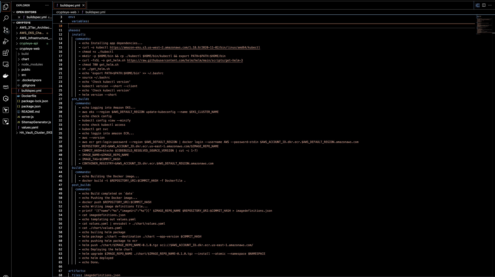

5. Setup codePipeline. It should upload the helm charts to ECR and deploy them to the target EKS cluster.

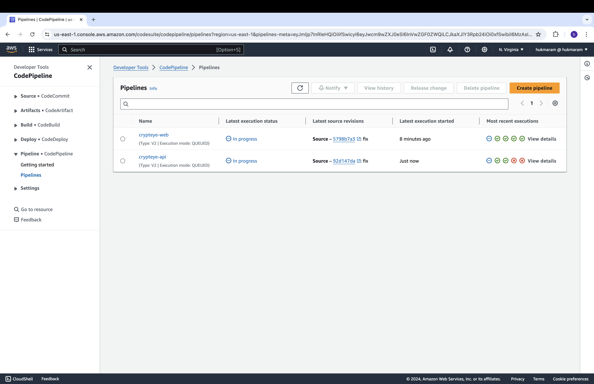

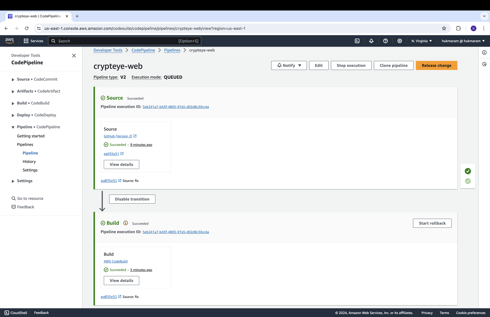

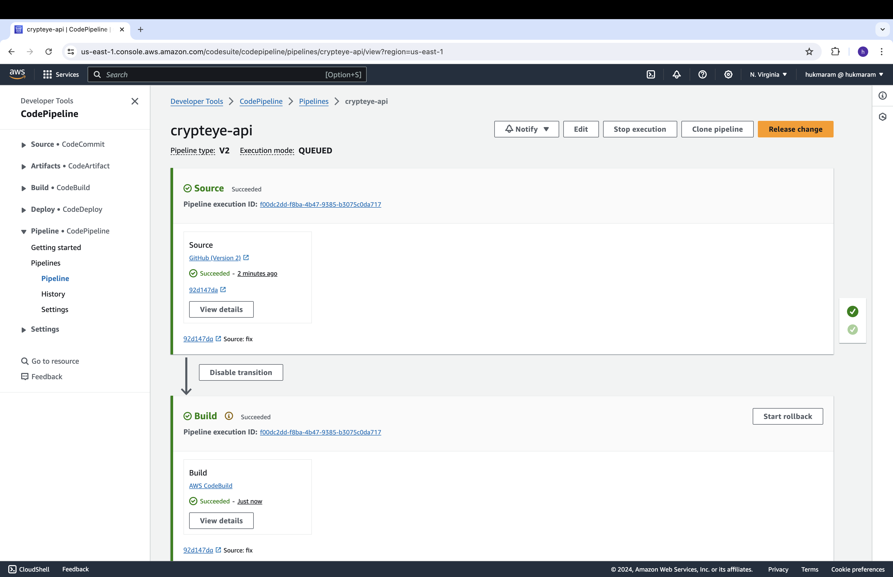

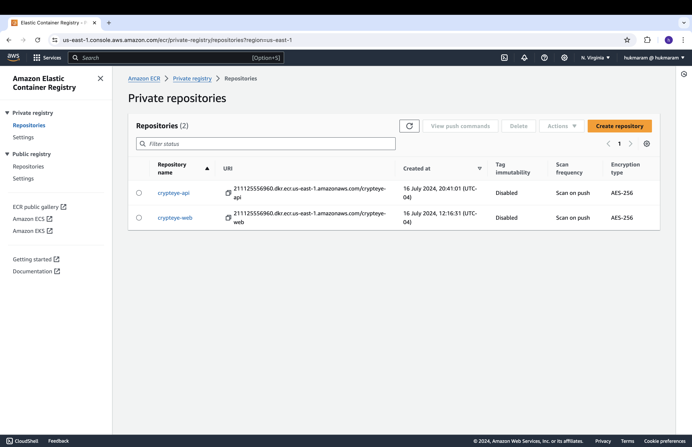

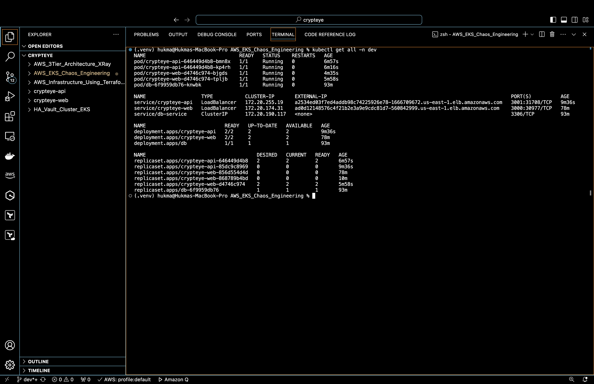


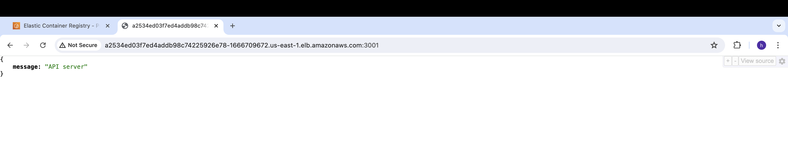

## Chaos Engineering using Litmus Chaos On EKS cluster

# Overview

Chaos Engineering is about getting ready for unexpected problems. It involves testing a system to see how well it can handle disruptions, similar to real-life incidents. We will use LitmusChaos to create the testing environment. LitmusChaos is a tool for Chaos Engineering that works with Kubernetes.

LitmusChaos uses Kubernetes to create, manage, and monitor disruptions through specific resources:

_ChaosEngine_: Links a Kubernetes application or node to a chaos experiment.
_ChaosExperiment_: Contains the settings for a chaos experiment.
_ChaosResult_: Records the outcomes of a chaos experiment.

Now that we know the tools we'll be using, let's get started!

1. We will install Litmus Chaos on EKS using helm. The helm chart will install necessary CRDs, service accounts and Chaos Center.

```
helm repo add litmuschaos https://litmuschaos.github.io/litmus-helm/
```

Now create a separate namespace for litmus chaos

```
kubectl create ns litmus
```

2. By default Litmus chaos helm chart creates a Node port service, so in order to access Litmus chaos UI we need to install LoadBalancer by over-riding helm values.

```
portal:
  server:
    service:
      type: ClusterIP
  frontend:
    service:
      type: LoadBalancer
```

3. Install Litmus Chaos using helm.

```
helm install chaos litmuschaos/litmus --namespace=litmus -f ./Litmus-Chaos/override-litmus.yaml
```

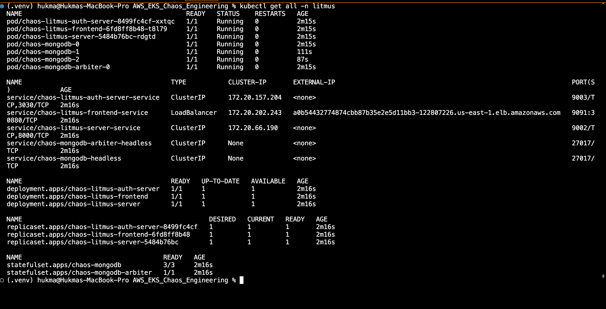

4. visit the loadBalancer URL and login with default username and password: `admin/litmus`. It will ask to reset the password on first login.

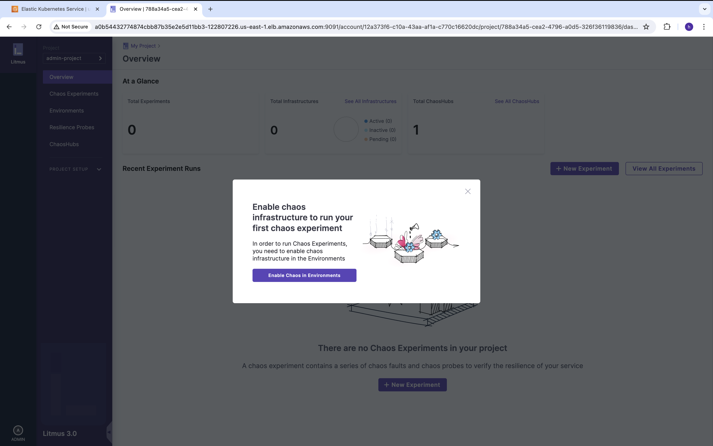

5. Go to environments section and add a new enviroment. Give a name and save it.

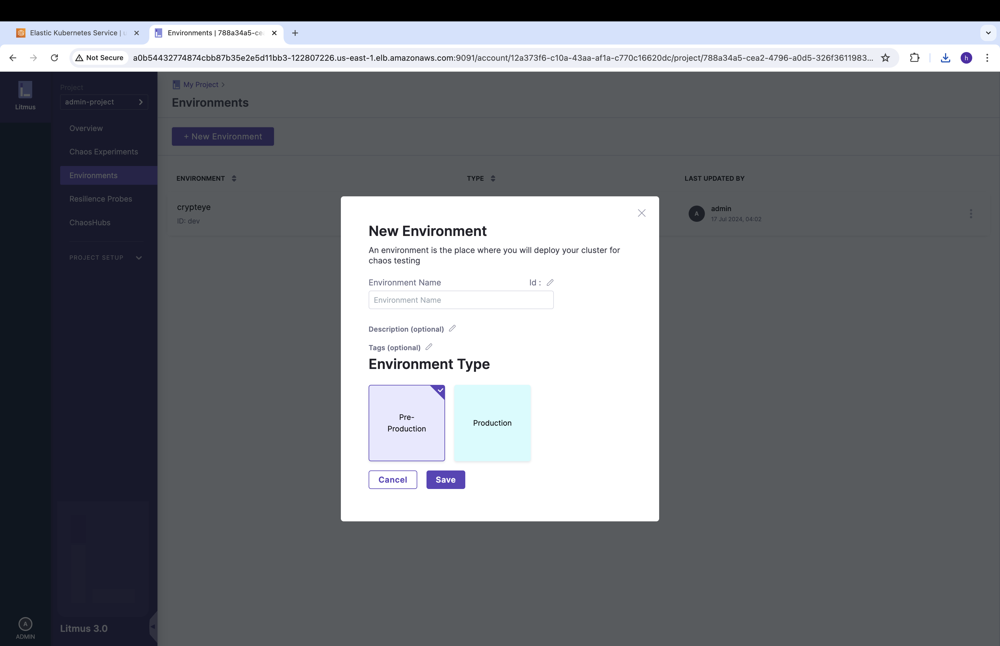

6. Nevigate to the newly created environment and click `Enable Chaos` and follow instruction. It will download a file named `dev-litmus-chaos-enable.yml` with a namespace, service account and multiple CRDs which is required to enable Chaos in the cluster.

Execute it using below command:

```
kubectl apply -f ./Litmus-Chaos/litmus-chaos-enable.yml
```

7. Navigate back to the Terminal, and confirm the agent installation by running the command below:

```
kubectl get pods -n litmus
```

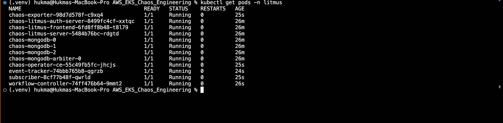

8. Next, verify that LitmusChaos API resources have been created using the following command:

```
kubectl api-resources | grep chaos
```

You should see a response that shows ChaosEngines, ChaosExperiments, and ChaosResults, as below

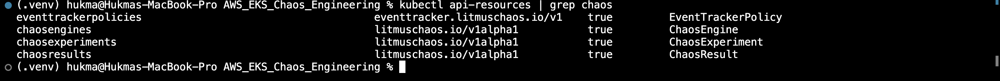

## PART-1 Pod Delete Experiment

Litmus ChaosHub is a public repository where the LitmusChaos community shares their chaos experiments. Some examples are:

- pod-delete
- node-drain
- node-cpu-hog

We'll use the pod-delete experiment to test cluster resilience when a pod is deleted.

Pod delete fault disrupts the state of Kubernetes resources. This fault injects random pod delete failures against specified application.

We expect that the Amazon EKS cluster should auto deploy the pod when there is disruption.

Let's test this!

1. Start by going back to the Litmus UI and click Chaos Experiments in the left side panel. Give a name to the experiment and select the Chaos Infrastructure we created earlier.

2. Click templates from ChaosHub then select experiment Pod delete.

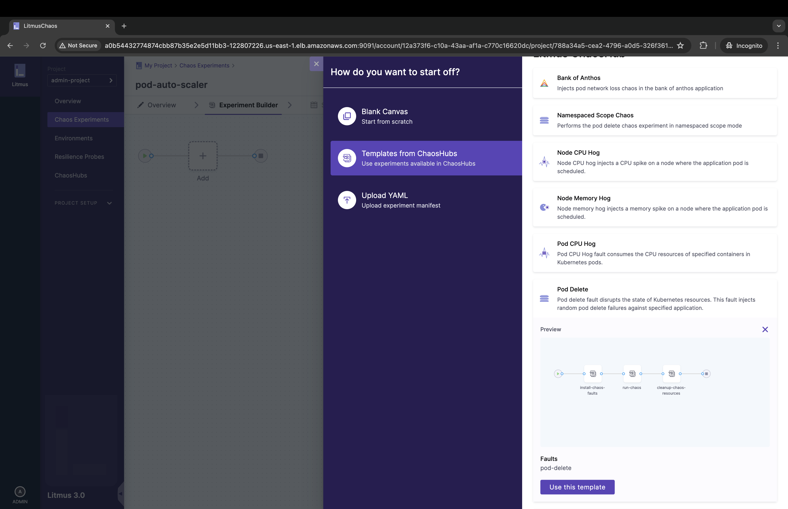

3. Click run chaos in the experiment builder and set the target application accordingly. we will select api deployment in the namespace dev which is deployed using the helm chart by our pipeline.

~[target_application](./images/litmus_target_application.png)

4. In the sidebar there is option to tune fault. Keep default values and give a score to this experiment out of 10. I kept it 10, This is used to calculate the overall resilience score of the application.

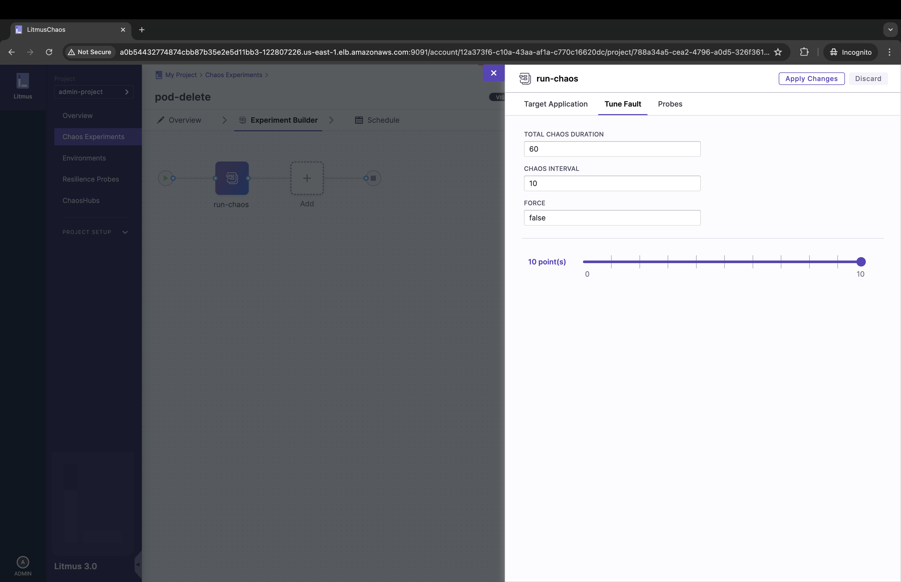

5. In the probe section we can define probes which will be validated before or after or continuously during the experiment. This is called hypothesis.
   There are four types of probes we can define-

   - httpProbe: Query health/downstream URLs
     The httpProbe allows developers to specify a URL which the experiment uses to gauge health/service availability (or other custom conditions) as part of the entry/exit criteria. The received status code is mapped against an expected status. It supports http Get and Post methods.

   - commandProbe: Execute any user-desired health-check function implemented as a shell command
     The command probe allows developers to run shell commands and match the resulting output as part of the entry/exit criteria. The intent behind this probe was to allow users to implement a non-standard & imperative way of expressing their hypothesis. For example, the cmdProbe enables you to check for specific data within a database, parse the value out of a JSON blob being dumped into a certain path, or check for the existence of a particular string in the service logs.

   - promProbe: Execute promql queries and match prometheus metrics for specific criteria
     The promProbe allows users to run Prometheus queries and match the resulting output against specific conditions. The intent behind this probe is to allow users to define metrics-based SLOs in a declarative way and determine the experiment verdict based on its success. The probe runs the query on a Prometheus server defined by the endpoint, and checks whether the output satisfies the specified criteria. A PromQL query needs to be provided, whose outcome is then used for the probe validation.

   - k8sProbe: Perform CRUD operations against native & custom Kubernetes resources
     The k8sProbe addresses verification of the desired resource state by allowing users to define the Kubernetes GVR (group-version-resource) with appropriate filters (field selectors/label selectors). The experiment makes use of the Kubernetes Dynamic Client to achieve this. It supports create, delete, present and absent operations.

6. we will do a http request to check the application health status.
   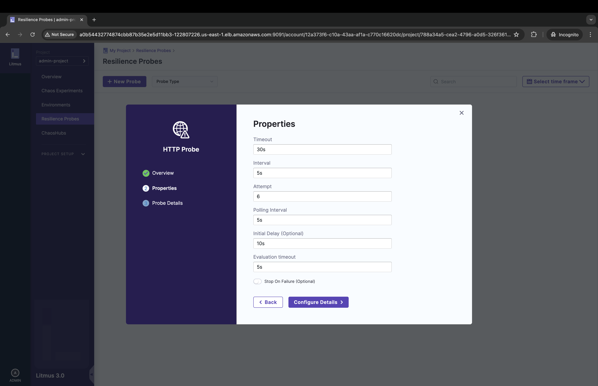
   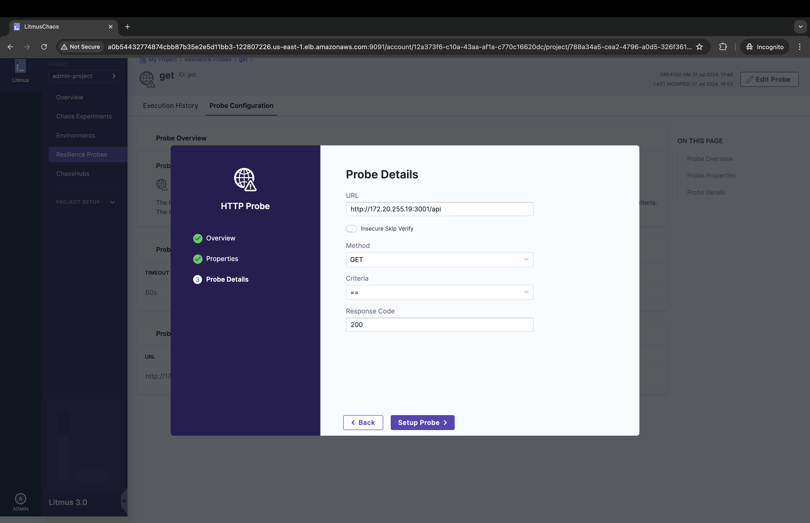

7. There are 5 types of modes when this probe can be applied which are SoT, EoT, Edge, Continuous, OnChaos.
   We will execute this probe before and after the experiment to validate the hypothesis (Edge).
   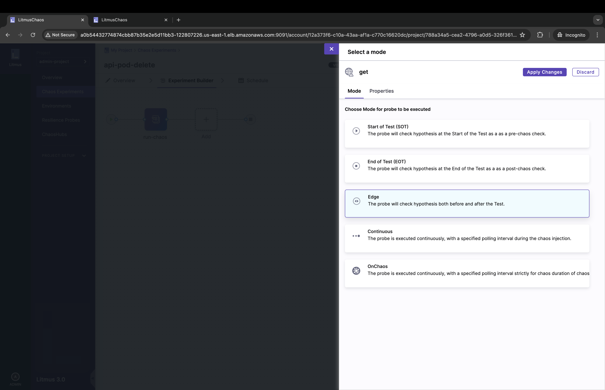

8. Save the changes. Similarly we can add more experiments to the same workflow to be executed after one another. We can also schedule the experiment according to the cron schedule or trigger it manually.

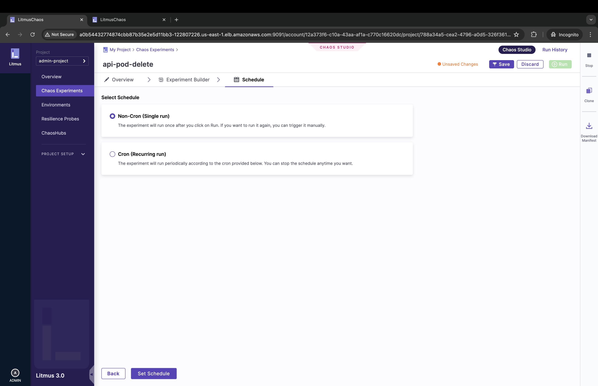

Using the advanced option we can also set Node Selector and Tolerations so the pods will be scheduled accordingly.

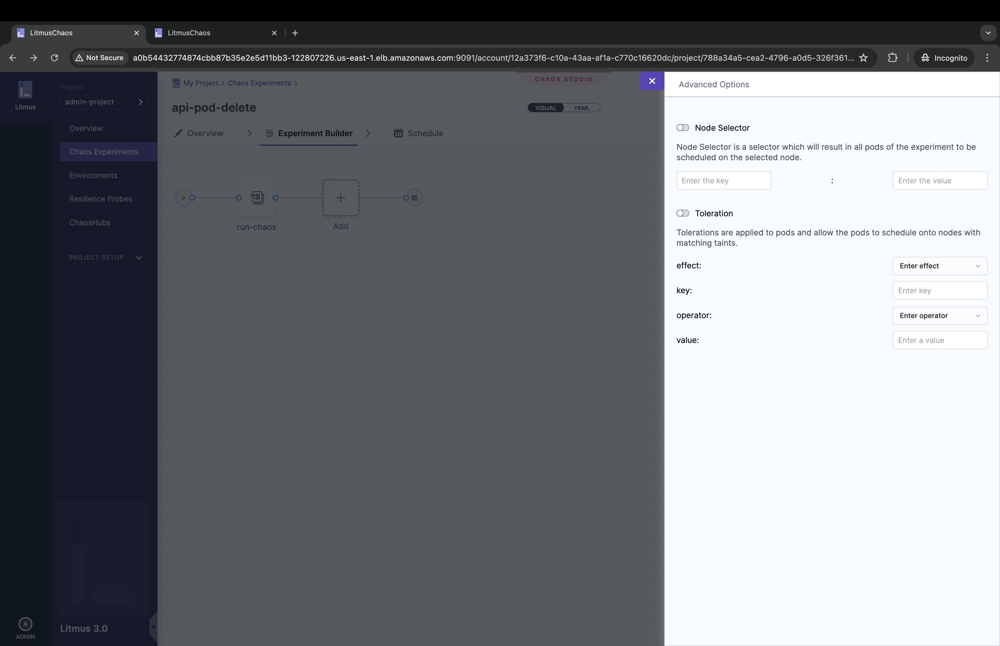

9. Click run to run the experiment against api deployment in dev namespace.

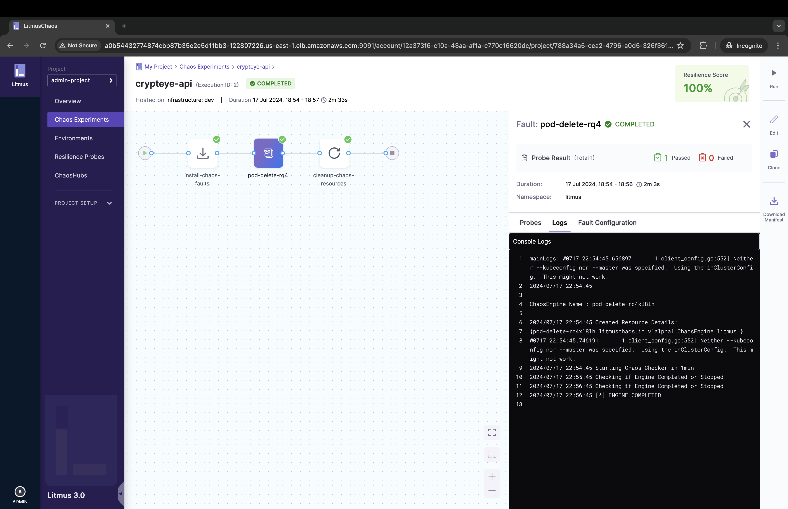

The experiment successfully completed since the pod was auto-created on deletion as it was deployed as a deployment in k8s cluster. The httpProbe validation was completed successfully before and after the experiment execution.

## PART-2 Pod Auto-Scaler Experiment

We can use an app called lens which is a Kubernetes IDE to view state of our cluster while doing these experiments.

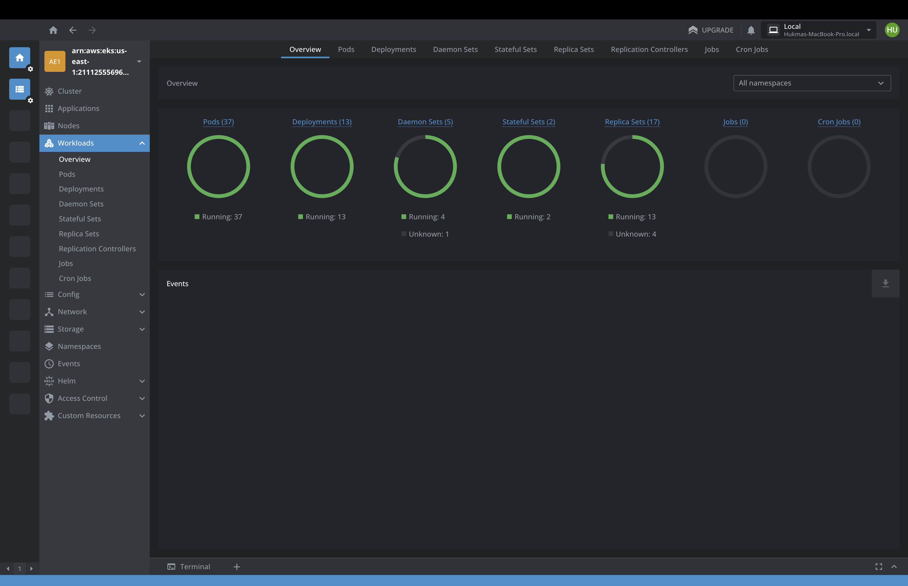

The `pod-autoscaler` experiment will check how well the nodes can handle the number of replicas needed for a deployment. It will also test the cluster's ability to auto-scale.

The hypothesis is that the Amazon EKS cluster should automatically scale up when there isn't enough capacity to run the pods.

1. Edit our previous workflow and add an pod-autoscaler experiment to it. and run the workflow.

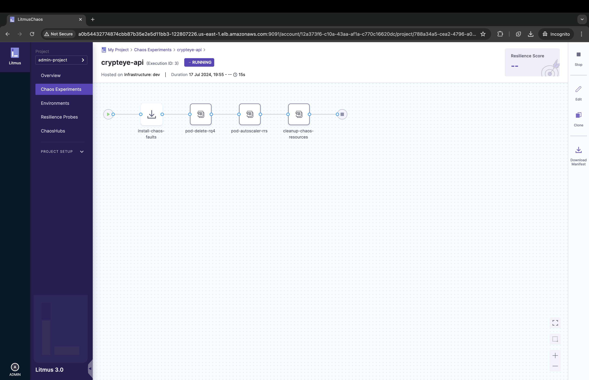

2. We can verify the experiment execution in the lens app -
   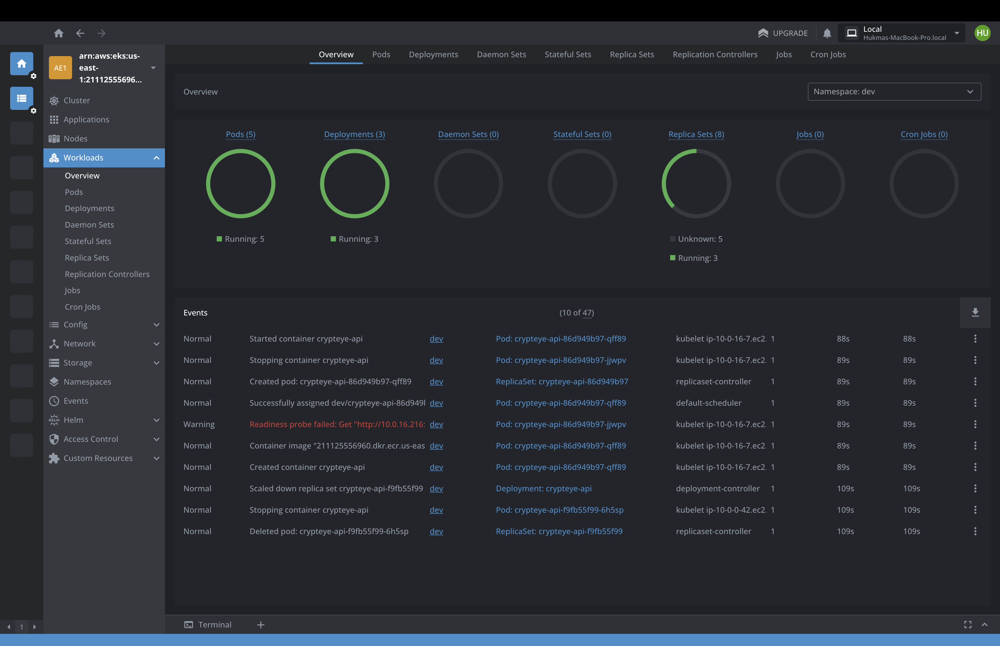

3. I set replica count to 5 for the pod-autoscaler experiment and thus we can see there are new pod replicas are created by the chaos experiment.
   We can verify the same in the lens events that new replicasets were created by the Litmus chaos and deleted after the verification.

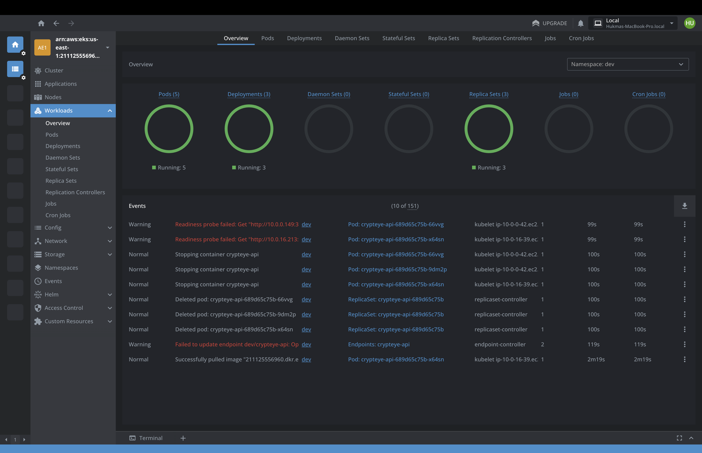
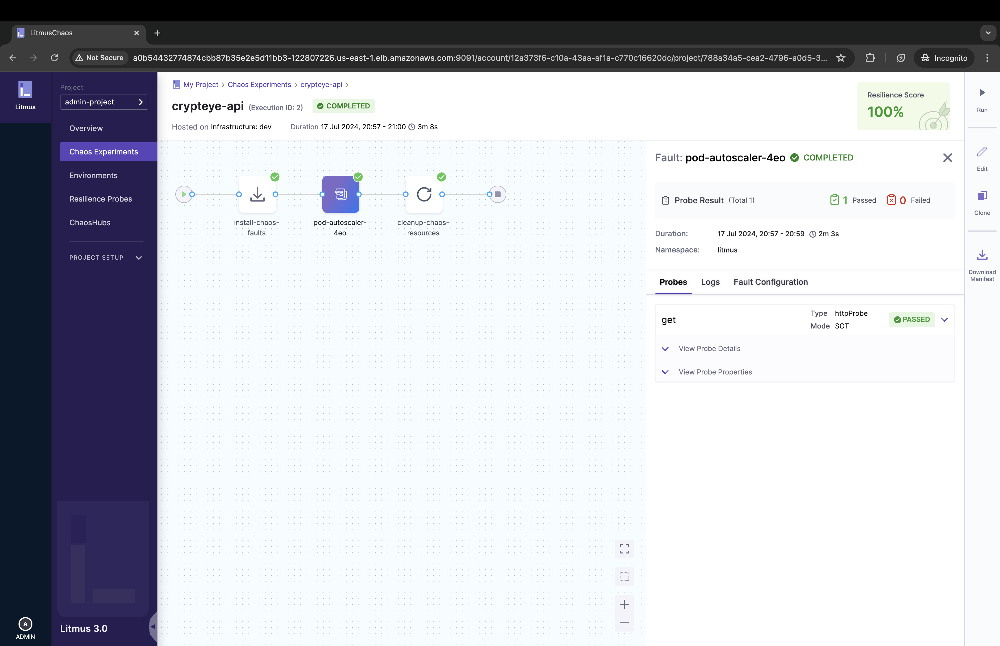

4. Let's set the replica count to extremly high number say 150 and run the workflow.

As expected the pods are not getting scheduled to the fact that avilable resources are not sufficient to run these number of pods.

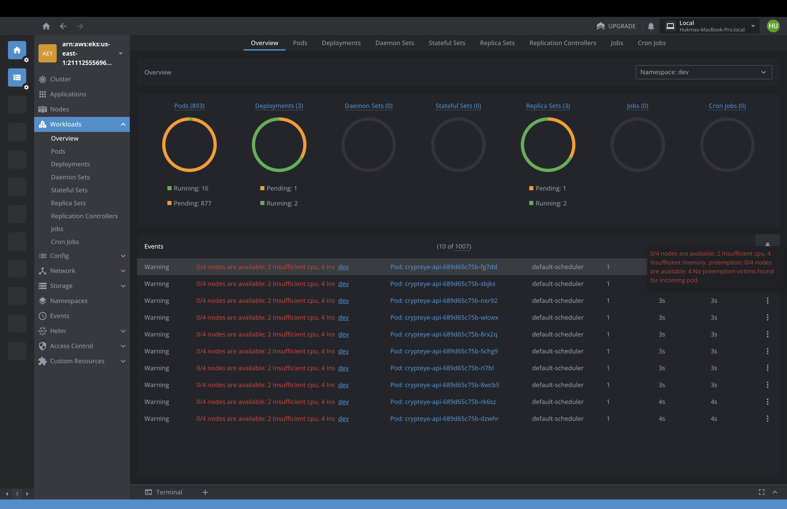

and as expected the workflow has failed.

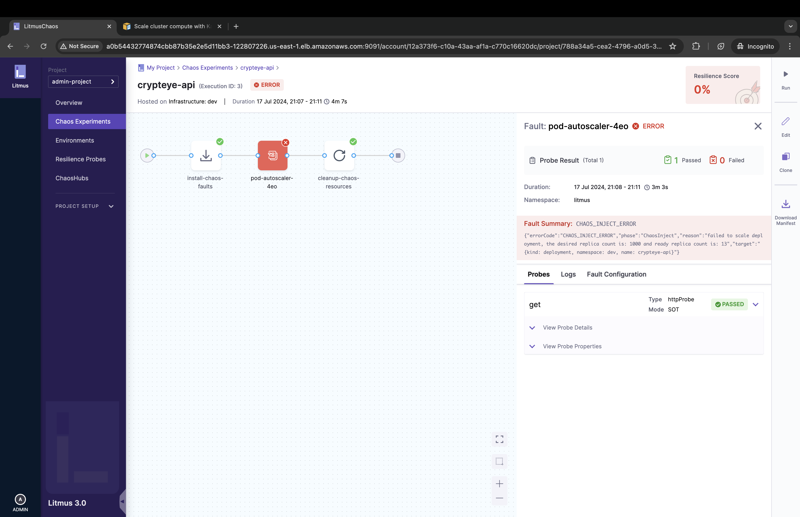

## Setting up Cluster Auto-scaler for EKS

We will install Cluster Autoscaler in our EKS cluster to automatically scale up and scale down the number of Nodes accordingly.

Here are the steps-

1. We will create an IAM policy using aws cli to grant permission to scale up and scale down the target ASG. Execute following command-

```
aws iam create-policy \
    --policy-name AmazonEKSClusterAutoscalerPolicy \
    --policy-document ./auto-scaler/cluster-autoscaler-policy.json
```

2. Next create an IAM role and attach the policy to it using eksctl (replace $ACCOUNT_ID with your account id).

```
eksctl create iamserviceaccount \
    --cluster=my-cluster \
    --namespace=kube-system \
    --name=cluster-autoscaler \
    --attach-policy-arn="arn:aws:iam::$ACCOUNT_ID:policy/AmazonEKSClusterAutoscalerPolicy" \
    --override-existing-serviceaccounts \
    --approve
```

3. Varify

```
kubectl describe sa cluster-autoscaler -n kube-system
```

4. Next, download the autoscaler using

```
curl -o ./auto-scaler/cluster-autoscaler-autodiscover.yaml https://raw.githubusercontent.com/kubernetes/autoscaler/master/cluster-autoscaler/cloudprovider/aws/examples/cluster-autoscaler-autodiscover.yaml
```

5. Make below changes in the autoscaler yaml
   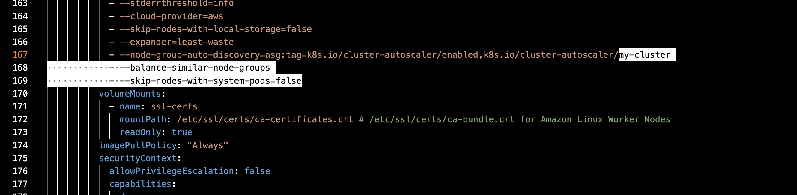

6. deploy the auto scaler

```
kubectl apply -f cluster-autoscaler-autodiscover.yaml
```

7. Patch cluster-autoscaler to annotate using following command:

```
kubectl patch deployment cluster-autoscaler \
-n kube-system \
-p '{"spec":{"template":{"metadata":{"annotations":{"cluster-autoscaler.kubernetes.io/safe-to-evict": "false"}}}}}'
```

8. Next, use the following command to set the Cluster Autoscaler image deployment:

```
kubectl set image deployment cluster-autoscaler \
-n kube-system \
cluster-autoscaler=k8s.gcr.io/autoscaling/cluster-autoscaler:1.30
```

9. View your Cluster Autoscaler logs with the following command:

```
kubectl -n kube-system logs -f deployment.apps/cluster-autoscaler
```

10. All done! Now auto-scaler is setup and ready to scale our cluster automatically. Now let's run the pod-auto-scaler workflow again using Litmus chaos dashboard.

11. This time the experiment ran successfully and we can verify in the lens app that 2 new nodes were added by the auto-scaler to launch new pods.


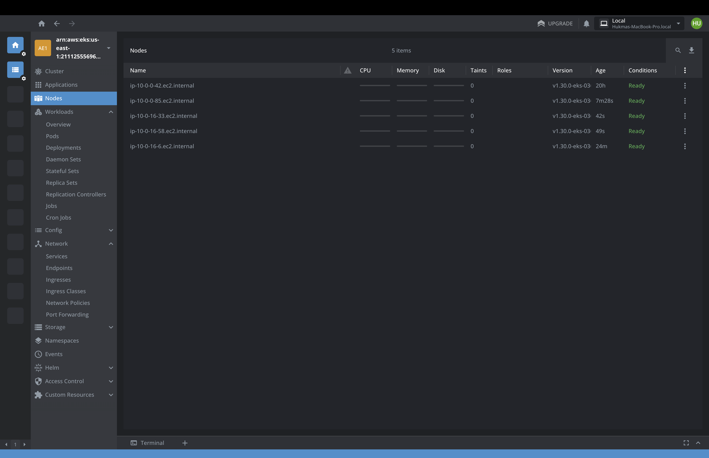

---

Similarly, we can also perform other experiments such as node drain or node CPU hog experiments, and the state of the cluster can be observed using the Lens Kubernetes IDE.

**NOTE:** We can use GitOps to automatically store Chaos workflow configurations in a GitHub repository. Any changes made in GitHub will automatically sync with the Chaos Center.

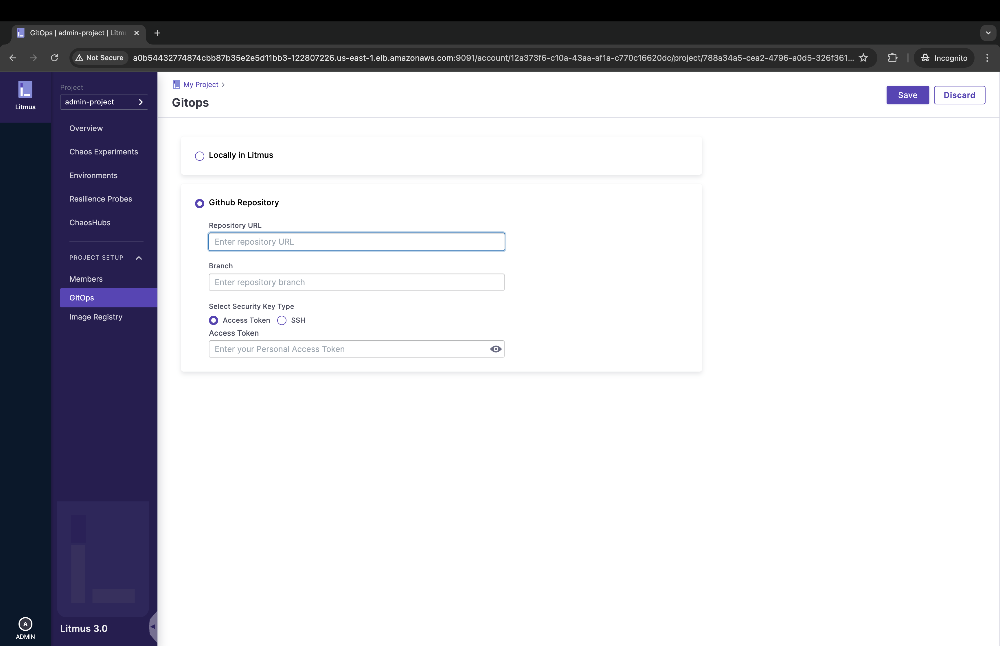

**NOTE:** We can trigger workflows using EventTrackerPolicy in Kubernetes. To do so, we need to annotate the target Kubernetes application with `"litmuschaos.io/workflow={workflow_id}"` and `"litmuschaos.io/gitops=true"`, and then create an EventTrackerPolicy which will trigger the workflow when the condition is met.

# Other Chaos Engineering Tools

### Chaos Toolkit

Chaos Toolkit is a Python-based tool for Kubernetes chaos engineering using code.

### KubeInvaders

KubeInvaders works only for pod deletion. It’s a fun way to practice Kubernetes chaos engineering in the terminal.

# Cleanup

To clean up everything, simply run `terraform destroy` since our infrastructure is created using Terraform IaC scripts.

