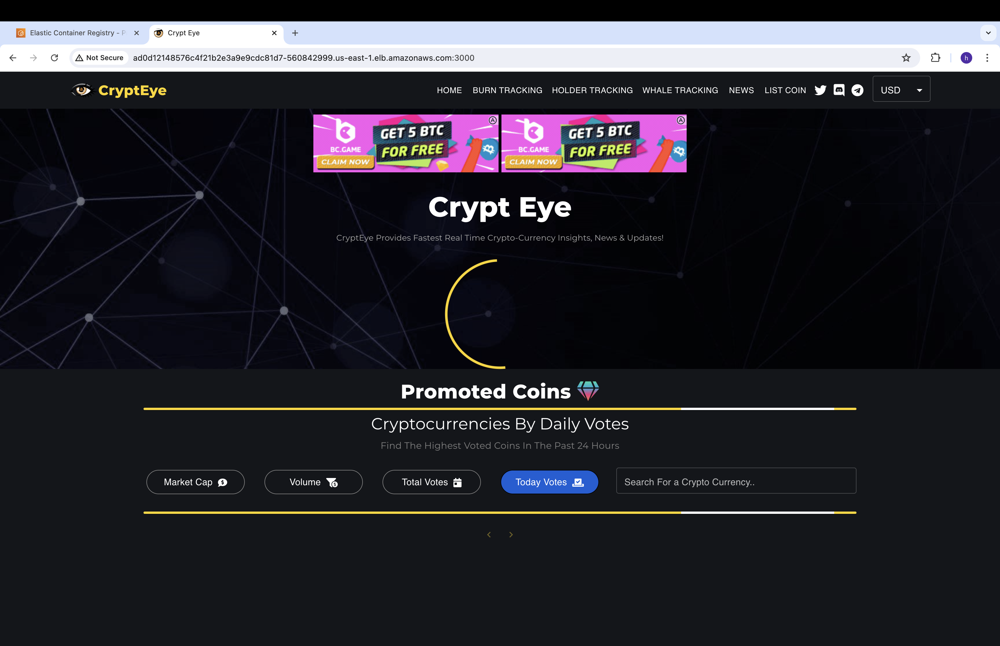

# AWS_EKS_CICD_Chaos_Engineering

## Overview 
This project has covered following topics- 
1. Created k8s manifest files for db, api and web microservices and created helm chart templates.
<!-- 2. Set-up terraform remote backend to store statefile in S3, Store lock file to dynamodb table and setup terraform spaces. -->
2. Setting up a HA Vault cluster in EKS and accessing secrets in terraform using terraform vault provider.
<!-- 4. Modify helm charts to include a vault sidecar agent to inject secrets from vault. -->
3. Creating EKS dev cluster using terraform and deploying database using helm chart using IaC script.
4. Setting up a CICD pipeline for web and api microservices to build source code, build docker images, push images to ECR, Create helm packages and push the packages to ECR and deploy the helm packages to the EKS cluster in dev namespace.
5. Demonstrate Chaos Engineering using Litmus Chaos tool.

Used tools: EKS, Terraform, Helm, Vault, ECR, GitHub, CodeBuild, CodePipeline, docker,

## Vault Setup

We are going to use vault to store required secrets for our application. We will store db_name, db_username, db_password and db_root_password in the HA Vault.

NOTE: The vault cluster is in a separate EKS cluster than the application eks cluster for higher resilience and availability.

Follow below steps:

1. Setup Vault HA cluster and enable auto unseal to access secrets without manually unsealling it. I have setup HA vault cluster separately, the instructions can be found `here`(https://github.com/Hukmaram28/HA_Vault_Cluster_EKS/).

2. Exec to the leader vault pod and store secrets in kv-v2 engine and create a policy and role. To do so please execute below commands-
   ```
   export VAULT_TOKEN=""
   vault secrets enable -path=crypteye kv-v2
   vault kv put crypteye/database/config db_name="db" db_username="admin" db_password="password"
   ```
   ```
   vault policy write terraform - <<EOF
   path "crypteye/data/database/config" {
   capabilities = ["read"]
   }
   EOF
   ```
   ```
   vault auth enable approle
   ```
   ```
   vault write auth/approle/role/terraform token_policies=terraform
   ```
   ```
   vault read auth/approle/role/terraform/role-id
   ```
   ```
   vault write -f auth/approle/role/terraform/secret-id
   ```

3. Copy role_id, secret_id, vault host url and other variables and provide them in `Iac/Terraform/variables.tf` file before creating the infrastructure, thus terraform will read the secrets from the vault server and use the db credentials to create the mysql database. This is just to demonstrate how to access Vault in terraform. To use vault secrets in the pods we should use vault sidecar agent to inject secrets in the containers.

## EKS cluster setup [Separate cluster than Vault]

1. Bring up EKS cluster and create a namespace called dev to deploy the microservices. IaC for the cluster can be found in `IaC/terraform` folder. This willl do following:

   - Using main.tf we are creating an EKS cluster with 2 t2.micro nodes.
   - Using kubernetes.tf we are connecting to the EKS cluster and creating a namespace called dev.
   - Using helm.tf, we are deploying our mysql database helm chart.
   - Using vault.tf, we are accessing db credentials from vault server (uncomment and use accordingly) to make the credential available to the mysql container.

2. Create an OIDC provider to use IAM roles in the EKS cluster (If it is not created while cluster creation):

```
eksctl utils associate-iam-oidc-provider --cluster my-cluster --approve
```

3. Before deploying mysql helm chart, we need to enable volume support with EBS CSI driver add-on if it is not done during cluster creation (you can comment out helm.tf content during the first execution to avoid db deployment as it will fail).

Run the following commands:
```
eksctl create iamserviceaccount \
 --name ebs-csi-controller-sa \
 --namespace kube-system \
 --cluster my-cluster \
 --attach-policy-arn arn:aws:iam::aws:policy/service-role/AmazonEBSCSIDriverPolicy \
 --approve \
 --role-only \
 --role-name AmazonEKS_EBS_CSI_DriverRole --region us-east-1
```

```
eksctl create addon \
 --name aws-ebs-csi-driver \
 --cluster my-cluster \
 --service-account-role-arn arn:aws:iam::$(aws sts get-caller-identity --query Account --output text):role/AmazonEKS_EBS_CSI_DriverRole --region us-east-1
```
```
eksctl utils migrate-to-pod-identity --cluster my-cluster --approve
```

4. If PVC is still unable to create, delete the existing storage class and recreate it with the binding mode set to Immediate using:
`./StorageClass/gp2.yaml`.
Run below commands:
`kubectl delete sc gp2`
`kubectl apply -f ./StorageClass/gp2.yaml`

Now uncomment helm.tf and db helm chart can be deployed by applying `./IaC/Terraform/helm.tf`.

5. Mysql db server is deployed as part of infrastructure as this is a one time time activity, This can be done manually too. A new database will be created, The db credentials can be provided in the variables.tf file before applying the Iac Scripts or they can be read from vault server.


## CICD Pipeline setup

1. To make the web and api microservice deployments automated to the EKS cluster using codePipeline, we will make changes to the buildspec.yaml file to Install helm, template out the helm values.yaml file and package helm chart and push to ECR then deploy it to the EKS cluster. In case of deployment failure we can rollback the deployment to the previous helm release using helm rollback command.

2. In order to codeBuild to work properly we need to assign an IAM role with certain AWS managed policies. Create an IAM role with name like `CodeBuildEKSRole` and attach following policies to it (refer to CodeBuildEKSRole.sh)-
 

3. Even though the CodeBuild role has permission to authenticate to the cluster, it doesn’t have the required RBAC access to do any other action on the cluster. So we need to edit aws-auth configmap.
```
eksctl create iamidentitymapping --cluster my-cluster --arn arn:aws:iam::211125556960:role/CodeBuildEKSRole --group system:masters --username CodeBuildEKSRole
```

4. Make the changes to buildspec.yaml file in api and web microservices accordinly.

 


5. Create codePipeline and it should upload the helm chart to ECR and deploy the web and api microservices to the target EKS cluster.





## Chao Engineering using Litmus Chaos

